# OVRTT - Open VR Toe Tracker

 ## What is OVRTT?
OVRTT is a DIY solution for a simple toe tracker that can be used in VR.

### How does OVRTT work?
OVRTT works by using a linear position sensor (tied to your toe) connected to an Arduino Nano, which sends the position data to your PC via Bluetooth. On your PC an application called OVRTTconsole will then send that data to VRChat via OSC. If your avatar is set up to read that data, you can move your toes in VR!

### What's required for OVRTT to work?
You will have to build the physical trackers by 3D printing some parts, solder some electronic components, then put it all together. The trackers themselves are designed to fit between your foot strap and Vive 3.0 (or the older Vive) trackers.

On your PC, you will have to run the OVRTTconsole to receive and send that data to VRChat. The OVRTTconsole is made specifically for this project, and all the source code is available, should you wish to check it out, or modify parts of it for your specific use case.

And lastly, you will have to modify your avatar and add some blendtrees so your toes can move. Your avatar needs enough space in it's parameters settings to fit two Float type parameters.

---

### Quick demo video

https://github.com/user-attachments/assets/d189bf97-c6d0-47d8-8f5b-3956b5103565

### Showcase pictures

---
#### Contents:
0. [IMPORTANT THINGS!](#IMPORTANT-READ-THIS-BEFORE-CONTINUING)
1. [Sourcing parts](#Sourcing-the-necessary-parts-items-and-tools)
2. [3D printing](#3D-printing)
3. [Soldering and assembly](#Soldering-and-assembly)
4. [Using the OVRTTconsole](#Using-the-OVRTTconsole)
5. [Configuring your avatar](#Configuring-your-avatar)
6. [Troubleshooting](#Troubleshooting)
7. [Miscellaneous](#Miscellaneous)

---

### Interested?
Great, the full part list and how to assemble guide is provided below. 

## IMPORTANT, READ THIS BEFORE CONTINUING:
The OVRTTconsole application uses 32feet/InTheHand library to connect to BLE devices. I was unable to get the library to work with newer versions of .NET, and have had to rely on .NET 7.0 to get the library to work. As of May 2024, Microsoft is no longer supporting .NET 7.0, which means no more security updates for this version of the runtime. The OVRTTconsole executable in the releases is published with all the necessary requirements inside the .exe file (hence it's large size, considering the actual program is rather simple). If that is not to your liking, you're welcome to create your own version (that ideally does not rely on .NET 7.0) with the provided source code and Visual Studio project files, or if you have the know-how, you can create your own solution from scratch!

### ALSO IMPORTANT:
When you first run the OVRTTconsole.exe application (and after it properly connects to the trackers), you might also receive a prompt asking whether you want to allow the application to access home/private and/or public networks. Since OSC is a network protocol, you will likely need to allow the application to use home/private networks, otherwise you may encounter issues when sending data to VRChat via OSC. The OVRTTconsole application does not need access to public networks. These settings can always be changed in the Windows Firewall configuration.

The OVRTTconsole also needs file reading permissions to read the config file and, in the case there is no config file provided, it also needs writing permissions to make one. These file reading/writing permissions are only needed inside the folder where the OVRTTconsole executable is located.

All of the source code for the OVRTTconsole is provided, as is the project file if you wish to import it into Visual Studio. If you do not trust the precompiled executable in the releases page, you can always download the project source, check the code, and build the executable yourself.

### I do NOT recommend downloading the OVRTTconsole executable from any other sources than this GitHub repository releases page. Do not run untrusted applications on your computer!

## GENERAL DISCLAIMER/WARNING:
As I am writing this how-to guide, I realize I cannot provide a warning and disclaimer for every single process involved in the project. So this is a general "only do this if you know what you're doing" disclaimer. Assembling electronic components can be dangerous. Only do this if you have prior experience and know you can do it safely. Take great care when using any sharp and/or otherwise dangerous tools. Use proper safety equipment, and take good care of the batteries. Don't use soldering equipment, drills and other high powered tools if you don't know how to use them safely. If somethings seems like a bad idea, it probably is. Don't hurt yourself or damage your property. If you don't know how to use or do something, ask a friend/acquaintance/family member with experience to help you. There could be mistakes in this guide, again, if something seems like a bad idea, it probably is, so if you spot an error in this guide, especially one that might carry risk of harm, drop a comment in th issues section.

I personally didn't solder my own trackers, nor did I heat press the threaded inserts. A friend who has experience soldering did it as a favor. I also found another acquaintance who printed the plastic parts. I have zero experience soldering and 3D printing myself, so I feel like I cannot provide a good enough guide for those processes in this project.

I also recommend reading this guide in it's entirety before doing any work on the components. There are segments of this guide that may explain certain things relating to other segments of the guide. Take some notes, there are a lot of details to think about before you start. Taking notes beforehand might save you a headache down the line.

---

## Sourcing the necessary parts, items and tools

### Tools:
- Access to a 3D printer, ideally with ABS or PETG printing capabilities (free, if you find a friend who has one, $10-35+ per tracker if using a service) + ABS/PETG printing filament ($20+ per 1kg/2lbs, you need max 5% of that for printing two trackers)
- Access to standard soldering equipment, ideally with tips for heat inserting m2 and 1/4" threaded inserts (free, if you have a friend who has one, renting one might be cheaper than buying the equipment)
- Standard precision tool set with small Phillips screwdrivers/attachment bits (\~$15+, many different options)
- Exacto knife or similar precision cutting tool (\~$3-10+, many different options)
- Instant glue for plastic parts (\~$5, many different options)

### Parts and materials:
- M2 hex nuts - standard hex dimensions, thin profile also works - at least four pieces (<$1 each)
- M2 screws - fully threaded, ideally with Phillips head - head diameter 4mm, 3mm length from under the head - at least two pieces (<$1 each)
- M2 screws - fully threaded, ideally with Phillips head - head diameter 4mm, 20mm length from under the head - at least two pieces (<$1 each)
- M2 threaded inserts for plastic heat insertion - height of the insert max 4mm, see notes - at least two pieces (a pack of 50+ is about $10)
- 1/4"-20 hex screw - fully threaded, hexagon head - length 13mm or 1/2" - at least two pieces (<$1 each)
- 1/4" threaded inserts for plastic heat insertion - height of the insert max 13mm, see notes - at least two pieces (a pack of 20 is about $10)

 

- Alps Alpine RDC1047A03 Linear type sensor - must be exact RDC1047A03 model (travel length 47mm), see notes - two pieces (~$7 each)
- CUI Devices SLW-121586-5A-D Slide switch - must be exact SLW-121586-5A-D model, or see notes - two pieces (<$1 each)
- Arduino Nano 33 BLE Rev2 - see notes - two pieces (\~$28 each)
- Micro-B USB cable capable of data transfer - any length (0.5m / 2' will suffice), or see notes - ideally two pieces but at least one is needed (\~$3 each)
- 9V battery (PP3 size) - ideally USB-C rechargeable - there are many options, I use EverActive EVHR22-550C, see notes - two pieces (\~$15 each for the EVHR22-550C)

 

- 9V battery clip-on wire - two pieces (<$1 each)
- a sacrificial UTP cable that you will dismantle for the small wires - at least 10cm/4 inches in length - (<$1)

 

- Teflon thread sealing tape - one roll (\~$1 per roll)
- Rubber bands - 60mm in circumference, or see notes - at least two pieces (\~$1 for a pack of mixed sizes with total 200 pieces)
- String - at least 30cm/11 inches in length - see notes (\~$1)

 

#### Not required but handy:
- Paper stapler, ideally one for No. 25 "Bambi" mini staples, but regular size No. 10 can work
- Drill with 1.5mm and 2mm drill bit
- Loctite thread locker fluid or similar
- Hot glue gun
- Sanding paper (for sanding out the 3D printed plastic, moderate grit)

 

### NOTES on the part list and prices:
- I strongly suggest finding a friend or acquaintance for 3D printing and soldering, unless you already have the equipment yourself. If you are a student, check if your school provides such services/equipment. You can save a lot of time and money this way.

- A lot of the parts needed (screws, threaded inserts, etc.) come in bulk packaging, so even if you see a pack of 200 going for $10 but a pack of 50 going for $7, it might still make more sense to buy the pack of 50, since you only need a few pieces. Some hardware stores will also let you buy singular pieces. Ask friends or acquaintances who might have these parts laying around to see if they can give you a few pieces.

- Threaded inserts come in various shapes and sizes from dozens of vendors. I bought the ["Ruthex"](https://www.ruthex.de/) brand, supposedly ["CNC Kitchen"](https://cnckitchen.store) also makes quality pieces. The size of the threaded insert, and the hole it's supposed to be heat pressed into should be provided in the product listing. The 3D models provided are made to fix the "Ruthex" [M2](https://www.ruthex.de/en/collections/gewindeeinsatze/products/ruthex-gewindeeinsatz-m2-70-stuck-rx-m2x4-messing-gewindebuchsen) and [1/4"](https://www.ruthex.de/en/collections/gewindeeinsatze/products/ruthex-gewindeeinsatz-1-4-kameragewinde-20-stuck-rx-1-4-20x12-7-messing-gewindebuchsen-fur-3d-druck-1) threaded inserts, but "CNC Kitchen" inserts should also fit. I don't know about other brands, so whatever you buy, make sure they fit into the provided models, otherwise you will have to make corrections to the dimensions on the 3D models yourself.

- There are cheaper imitations/knock-offs of the [Arduino Nano 33 BLE Rev2](https://store.arduino.cc/en-si/products/nano-33-ble-rev2) board out there. Prices vary from ~$7 and up. You might be able to save quite a few dollars by going for one of these instead of the original Arduino board. But be wary of fake and/or similar products that do not offer the same functionality. The board must have the same physical dimensions as the original Arduino board, must have BLE functionality, and must be compatible with the original Arduino scripts/Arduino IDE, otherwise you will have to adapt the scripts yourself.

- USB Micro-B cable is needed to connect to the Arduino board. The original Arduino Nano 33 BLE Rev2 can only be connected to a PC with a Micro-B cable capable of data transfer (many such cables are only capable of charging). If you buy a cheaper non-Arduino imitation of the borad, it might come with a different connector, so make sure you have that type instead. For testing purposes, it might be handy to have two such cables, since the OVRTTconsole will work only if it can connect to both devices.

- [Alps Alpine RDC1047A03](https://tech.alpsalpine.com/e/products/detail/RDC1047A03/#ancFig1) linear sensor was chosen specifically because it has a very low force requirement to move the slider. Initially I tried to use more common and cheaper linear potentiometers, but they were all too stiff to move and would require an elastic way too strong to keep under constant tension, and so it would very quickly become uncomfortable to wear. Another thing to note with the RDC1047A03 sensor is that it is not symmetric (like regular potentiometers often are). The sensor will only fit into the box one way, with the larger "edge" pointing toward the 20mm m2 screw. The "dock" that the sensor is supposed to fit into has slight gaps which are supposed to make wire management easier. You can opt to chose a cheaper, more common potentiometer, but a redesign of the box will be required to fit such a part. 

- [CUI Devices SLW-121586-5A-D](https://www.cuidevices.com/product/switches/slide-switches/slw-121586-5a-d#specifications) slide switch is a recommended part, because the 3D print designs are made to fit. You can use a different switch (or no switch at all), but if you do, you will likely need to change the 3D models to fit this new switch. The SLW-121586-5A-D slide switch was chosen because it's cheap, and has a decent sized switch lever height of 5mm, which makes it possible to attach a "slider" that blocks the battery charging port when the tracker is turned on, as the EVHR22-550C battery model is not supposed to be recharged while in use.

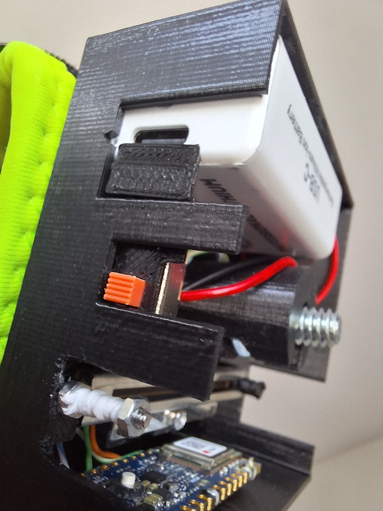

- The 9V battery [EverActive EVHR22-550C](https://everactive.eu/sites_collections/product/788) (link is for the non-C model, the official website does not list it for some reason) was chosen because it has a USB-C recharging port at the bottom. This enables the use of a "slider" that blocks the port when the tracker is turned on. Many 9V rechargeable batteries come in similar designs, but be wary. There is a lot of misinformation listed (on say Amazon) when looking through the different products if one searched for "9V rechargeable usb-c". Look through the reviews and see what they say. Any battery that boasts 1000+mAh capacity likely has a mistake with it's listing, and the "mAh" should instead say "mWh", meaning the battery has an actual capacity of only about 500mAh. A lot of these batteries come with Micro-USB ports as well, but I've read that these ports can have more issues with longevity than USB-C ports. The output voltage of these batteries may not always be 9V, (the EVHR22-550C only outputs 7.4V) but that does not matter, since the Arduino Nano 33 BLE Rev2 only needs a 4.5V input. The MP2322GQH buck converter on the board can accept a max 21V 1A input, so as long as your chosen battery can provide a min 4.5V input at max 22mA continuously for 8h+, you should be good. Again, you should pick a safe battery, and treat it with care. Do NOT damage or use a damaged lithium battery, do NOT expose it to heat, follow the instructions regarding the charging.
  - A point on battery life - the EVHR22-550C are advertised as max 550mAh capacity batteries. They should easily last 8h+ of continuous use with the tracker, however it is difficult to know how much current the Arduino board actually uses without a specific measuring device (which I do not have). There is also the additional factor of power loss through conversion, as the battery outputs a 7.4V voltage, which gets converted down to 3.3V with the MP2322GQH buck converter on the Arduino board. However, in the provided Arduino scripts, a few power saving options are enabled, but the code could be even more optimized for more efficient power consumption, should one desire to do so.
  - A point on recharging the battery - according to the (rather scarce) instructions provided with the EVHR22-550C battery, it is not supposed to be charged while in use. This is the reason I created the "front slider" that is attached to the power switch, which blocks the USB-C port when the tracker is turned on. The 3D printed "front slider" is a simple precaution that might save some headaches. I can only assume other batteries of this type come with similar instructions. Also if you buy a battery that has the recharging port on a different location than the EVHR22-550C, the "front slider" will likely not cover the port, and if you want to use some sort of physical cover for the port, you will have to figure out your own solution.

- The string that connects your toe with the linear sensor is purposefully left up to the user to decide what to use. In the demo clip above you can see how I hooked up mine. You may want to figure out a better solution to suit your needs. 

- The elastic band that will keep the sensor slider under tension can be replaced by different size elastic bands. There is a nook on the opposite side of the box from the switch that allows for attaching a different size band with a zip-tie or some other similar item. There are many options you can pick, but the functionality of the elastic band should equal to the 60mm band in the demo video clip above. The sensor slider must be under some tension for the entire travel distance, and have a resting position (still under slight tension) on the end closest to the 20mm m2 screw. I would not recommend using a smaller band, it might become uncomfortable to wear the tracker for long periods of time if the tension is too strong. Consider that the neutral "flat toe" position is somewhere around the middle of the sensor slider, so you should use a solution that keeps the minimum amount of tension required for the intended functionality. 

---
## 3D printing

I have to be honest, I didn't 3D print these myself. I know next to nothing about 3D printing, nor do I own a 3D printer, so an acquaintance printed these V1 boxes for me. 

They slightly differ from the design of the 3D models provided in this project, as I learned a few things when assembling my trackers. Hopefully the really bad parts are sufficiently dealt with in the newly designed models that are provided here. In any case, most things can be corrected even after the parts are printed, you just have to go about it in a smart way. This is where the Exacto knife and the glue will come in handy.

If you view the .stl files for the print models, for some reason the GitHub 3D preview messes up the LEFT model pieces. I don't know why. Before you print these files, you should throw them in your slicing software and make sure all the layers are good. If there are mistakes in the .stl files that I missed, they should be easily correctable in Blender, but you can also drop a comment in the project issues section and I will take a look.

---
## Soldering and assembly

I recommend you check out the [Images](Images/) folder in this project for more photos from multiple angles at various stages of assembly. These should serve as a reference for how the parts are supposed to fit.

### Prior to any assembly or soldering:
- Before you start with the actual assembly, you should make sure all the parts fit in their intended place inside the box, and that the box cover fits on top nicely when all the parts are inside. If any part doesn't fit, use the Exacto knife or similar sharp tool to scrape at the surfaces/edges that did not get printed nicely or cut away any excess plastic that does not allow for a snug fit. All 3d printers work under some tolerances and manual corrections will almost always be required in these 4 key areas:
  1. Battery compartment: on the side of the box where the battery is supposed to fit, there are 2 purposefully printed protrusions. These are meant to be cut to size after printing (not all PP3 batteries have exactly equal dimensions). The battery should fit snugly, without the side wall being pressed out. If you over-cut and the fit is too loose, you can wrap the battery in a few layers of teflon tape until the fit is snug or add some hot glue as padding to the box (but avoid putting hot glue near the battery until the hot glue cools down, do not expose the battery to excess heat!). 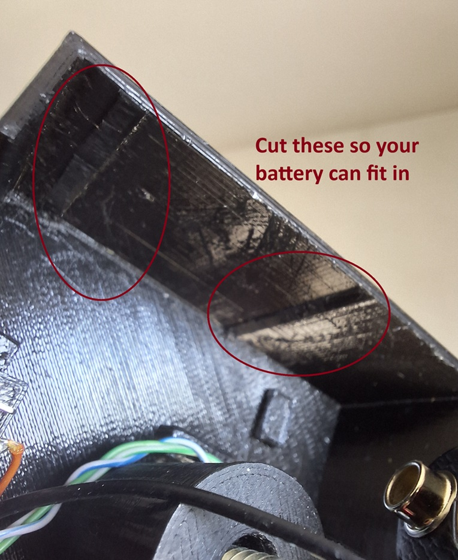
  2. ON/OFF switch compartment: if you have decided to use the SLW-121586-5A-D model slide switch, the plastic may need some cutting or scraping so that the switch fits nicely. You will have to do this on the box and the box cover. Again, carefully use the Exacto knife to cut or scrape away on the sides where it doesn't fit. If you cut too much plastic, instead of wrapping the switch in layers of teflon tape, you may hot glue it in, but only do so after soldering the wires and attaching the "front slider" what will block the battery charging plug, if you have decided to use one. 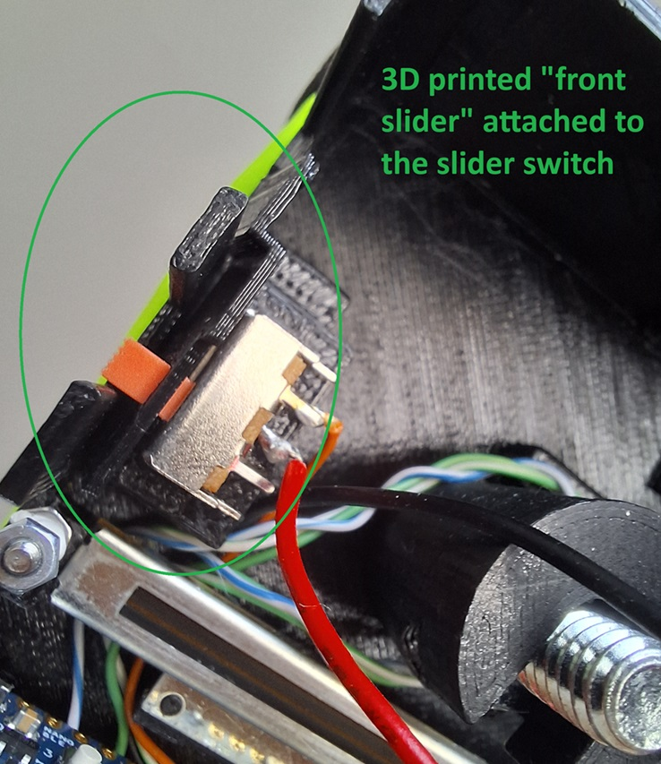
  3. Arduino Nano holders: the little holders in the box and the box cover can be particularly difficult to print accurately. (Honestly this entire part of the box probably needs a smart redesign the most.) They are meant to hold the Arduino board in place securely while providing enough space behind the board and underneath it for the wires. It is very likely you will need to cut/scrape the sides of the niches to make enough space for the board to fit. You should take extra care when cutting the niches on the box cover since the holders can easily be broken off the plate, in this picture below you can see mine tore off and I had glue it back together (using instant glue for plastic, rather than the hot glue gun). 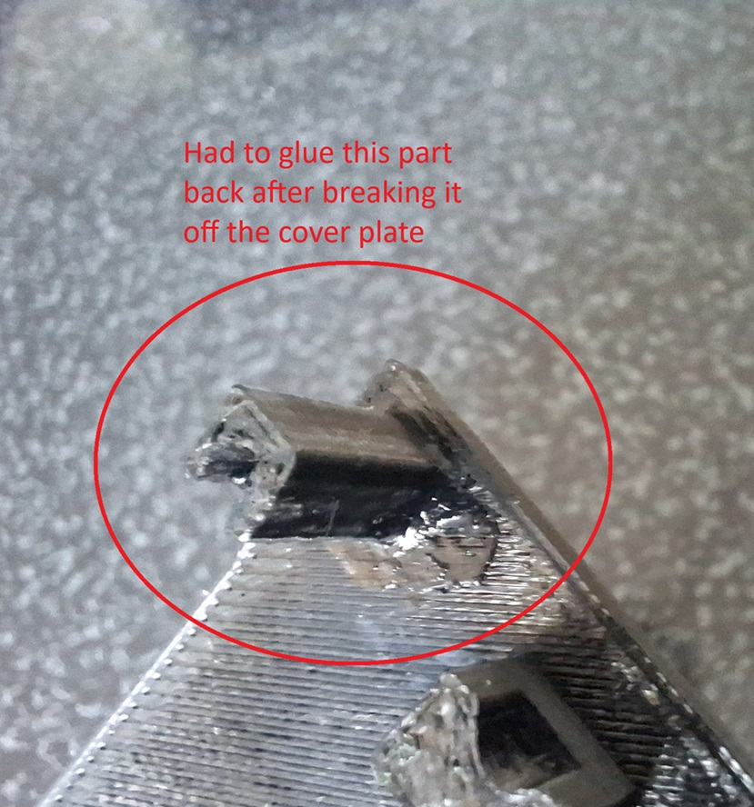
  4. 1/4" screw compartment in the central pillar: The compartment on the top of the pillar is meant to fit a 1/4" screw with a hexagon head. The height of the hexagon head should be about 4mm and the width from one hexagon side to an opposite side should equal to 11mm. If the hexagon head of the screw is smaller than that, you can wrap it in several layers of the teflon tape to make it fit snugly, and you can also hot glue it into the pillar itself (but be warned, hot glue it in only if you're absolutely sure all the parts fit together perfectly - slight movement of the screw might be needed to make the box cover fit snugly onto the box when all the components are inside). The screw should not be able to rotate when it's inside the pillar, otherwise you won't be able to screw on your Vive trackers.

- Make sure the little 3D printed "sensor attachment" part fits onto the plastic slider of the linear sensor. If it doesn't you will have to carefully scrape the insides of the hole of the attachment until it fits onto the plastic slider __VERY__ snugly. This is most easily achieved with a drill and a 1.5mm drill bit. Do not overdo it. The attachment should fit onto the plastic part without touching the metal sides of sensor housing, the gap should be about 1mm. 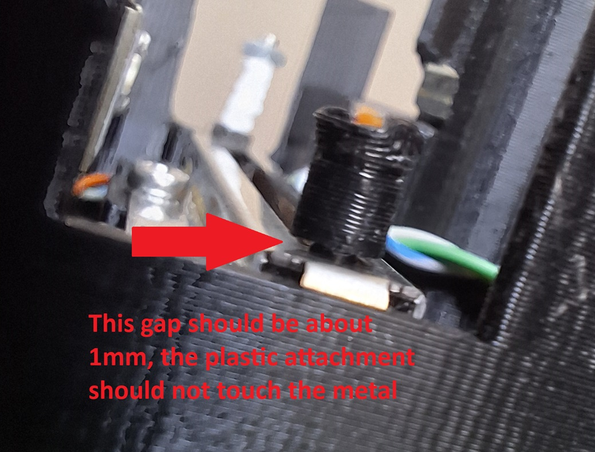
  - Once you are sure the attachment fits, add a drop or two of the instant glue into the hole of the attachment, then press it onto the plastic slider. When you do this, hold the slider upside down, so any excess glue that may come out of the hole will drop down onto the attachment and not into the sensor slider rails - this may render the sensor useless, if you don't hold it upside down.

- Make sure the 3D printed "front slider" (it looks like a paddle) can fit onto the SLW-121586-5A-D slide switch lever, if you have decided to use both. The hole in the front slider might need some cutting/scraping to fit snugly onto the switch lever. The fit of the front slider is not crucially important, since once it is installed on the switch lever and the box is closed with the cover, it shouldn't be able to come off easily. If you've cut off too much plastic, you can glue the switch on, but be extremely careful when doing so, especially when determining where exactly you want to glue the front slider on the switch lever. I haven't glued mine on, it really seems unnecessary.

- Make sure the 20mm m2 screw can fit into the hole on the side of the box and that you have enough room to tighten a nut on it -picture-

- It may prove to be useful to upload the sketches to the Arduino boards at this stage, prior to soldering the components. You will need to install the Arduino IDE from the official Arduino website, plug in your Arduino Nano board and install any necessary libraries in order for the Arduino IDE to work with the provided sketches and the board. There are many youtube videos on how to do this, the process is pretty straight forward.

- Not needed but may be useful: you may also cut a hole into the box wall where the Arduino Nano USB plug is, for easy access to the board if you plan on updating the scripts (perhaps for other uses) on the board. Scripts on the Arduino Nano can only be updated via the USB connection. -picture-

---

## IMPORTANT:
Soldering can be a dangerous activity, use proper protective gear, and only do this if you know how to __safely__! You can use the soldering iron to heat press the threaded inserts into the plastic, if you have the proper bits that fit the right size thread onto your soldering iron.

Also check the [Images](Images) folder of this project. You will find more pictures from multiple angles of the trackers with all the components inside, they can serve as good reference when building/soldering the device.

---

### Prior to soldering:
- Heat press the M2 insert in the middle of the "bar" in the 3d printed box 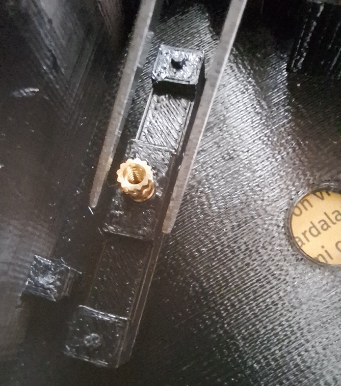
- Heat press the 1/4" insert in the bottom of the 3d printed "central pillar"
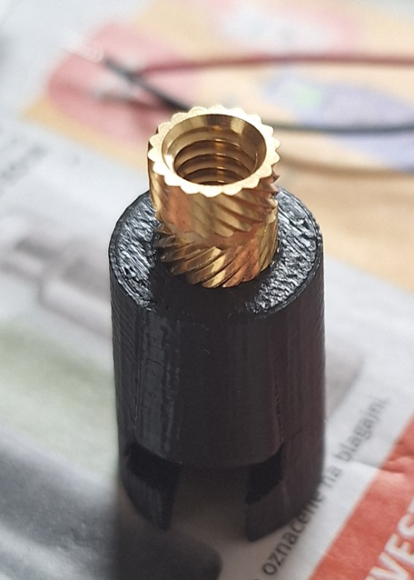
- Dismantle the UTP cable to obtain the small singular wires within, you need 4 per tracker, approximately 7.5cm/3" in length, you can also strip the ends of the protective shell. The length of the wires can be much smaller, but you will need to carefully plan out how all the electrical components fit inside the box
- Glue the sensor attachment to the sensor slider, if you haven't yet, this can be done later, once the sensor has been soldered and screwed in to the box, but it will be easier at this stage. Make sure the attachment can fit on to the sensor, then I recommend you put two drops of the instant glue into the hole of the attachment then turn the sensor upside down and press the attachment onto the plastic slider. This way any excess glue will not drop into the rails of the slider.

### Soldering:
- __IMPORTANT__: Never solder the battery directly - avoid exposing the battery to excess heat!
- __IMPORTANT__: The small wires from the UTP cable are not meant to be bent often, handle them with care. If they are bent many times on the same spot, they may snap in two, and you will have to re-solder the broken wire, or replace it with a new one entirely.

 

See this picture for a professionally constructed pin plan in paint! -picture-

 

- Starting with the 9V battery clip-on, solder the wire that attaches to the positive side of the battery to the middle pin of the SLW-121586-5A-D slide switch.
- Solder the wire that attaches from the negative side of the battery clip-on to one of the `GND` pins on the Arduino Nano broad.
- Solder one of the side pins on the SLW-121586-5A-D switch to the `VIN` pin on the Arduino board using a wire, it doesn't matter which, unless you've prepared very short wires. In that case, and if you've decided to use the "front slider" to cover the battery recharging port, you will solder this wire to the side that is closest to the battery, when the switch is fitted inside the box. -picture- On the second tracker, you will have to do the same, but on the opposite side, since the boxes are mirrored as far as the switch and battery positions go.

 

At this point the SLW-121586-5A-D switch should be soldered to the battery clip-on and the Arduino board. What is left is to solder the RDC1047A03 linear sensor to the Arduino board. If you have already uploaded the sketch to the Arduino board, you can test the solder by attaching the battery to the clip-on and flipping the switch! If a green light briefly turns on, then a blue one blinks about every 5 seconds, you're all good! 

Remove the battery from the clip-on before soldering the linear sensor.

 

- Solder the washer pin (pin that is opposite of the plate with the 3 holes) on the RDC1047A03 linear sensor to the `A4` pin on the Arduino board with a wire
- Solder the middle pin on the RDC1047A03 linear sensor to one of the `GND` pins on the Arduino board
- Solder the last pin on the RDC1047A03 linear sensor to the `3V3` pin on the Arduino board 
- __NOTICE__: the washer pin may __ONLY__ be soldered to one of the analogue pins on the board - `A0` to `A7` - the default Ardino sketches are set to read from the `A4` pin. If the other two pins of the linear sensor are soldered as described above (middle to `GND` pin) the raw curl value will be at 0, and the raw bend value will be at 1023. You may switch these two connections (middle to `3V3` pin) but then you will also have to edit the OVRTTconsole config file and swap the "curl" and "bend" values from the default configuration.

Repeat steps above for the other tracker.

At this point the soldering should be complete. Before you put all the components in the box, test the soldered parts to see if they work. If you have not uploaded the Arduino sketches to the Arduino boards, you should do so now. After the sketches have been uploaded to the board disconnect the board from the USB cable, then attach the 9V battery to the clip and flip the switch to turn the Arduino board on. A green light should briefly turn on, then a blue light should blink approximately every 5 seconds.

If you have soldered both Arduino boards with the necessary components, and have uploaded the sketches to both, you can turn them on, and run the OVRTTconsole application. The application should connect to both trackers, and once the connection is established, you can press 'o' to see the output values. Carefully slide the linear senors from one side to the other and look at the console to see the values change.

After you've confirmed your solders are good, and that the Arduino boards can both connect to the OVRTTconsole, you can begin placing the components in the box.

---

### Assembly:
- Put the 20mm M2 screw into the hole on the side of the box and tighten it with a nut. You can secure this nut with a little bit of thread locking fluid, if you have it. Wrap teflon tape around the protruding part of the screw, then add another M2 nut on the top of screw, which you can also secure with some thread locking fluid (but don't make a mess) 

- Remove the battery from the clip-on, it will make things a little easier
- Attach the "front slider" to the SLW-121586-5A-D switch, if you want to use it
- All the wires that are attached to the Arduino board should ideally run on the back of the board to the bottom of the box and underneath the linear sensor

- Before screwing in or hot gluing in any of the components, place the slider switch, the linear sensor, and the Arduino board into the box, so that all the wires, other than the ones connected to the 9V battery clip-on run underneath the sensor and behind the board
- There should be no wires hanging above the sensor slider! 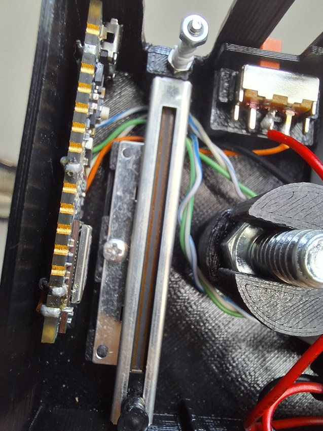

 

- __WARNING__: be mindful of the wires, do not bend them often, and make sure they don't get pinched against other surfaces!

 

- Make sure the SLW-121586-5A-D switch flips "ON" in the right direction - if you are going to use the "front slider" to block the battery charging port, it should flip "ON" towards the battery!

 

- If everything fits as it should, and the linear sensor slider has enough room to move the entire length of the rail, you can screw it in using the small 3mm M2 screw. You can also secure this screw with a little bit of thread locking fluid, if you have it. -short clip-

- Attach the battery to the clip-on and fit it into the box 

 

- Get a foot strap (make sure you use the proper left/right side strap with the correct side tracker) and unscrew the Vive tracker if you haven't already
- Get the 3D printed central pillar and insert the 1/4' screw in the top compartment if you haven't already 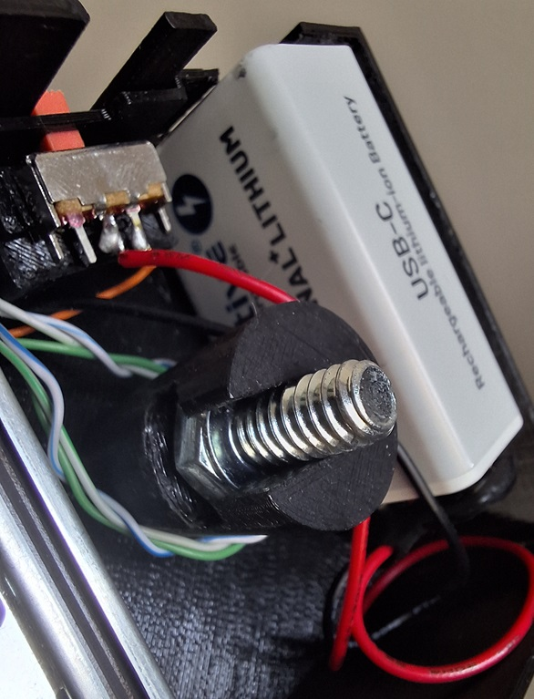

- Place the box on the strap so that the screw from the strap is looking through the central hole, then screw on the central pillar so tightly that the box doesn't move around. The opening opposite of the protruding 20mm M2 screw should point directly at your toes. Exactly which toe is up to you, but I recommend the second "pointer" toe.  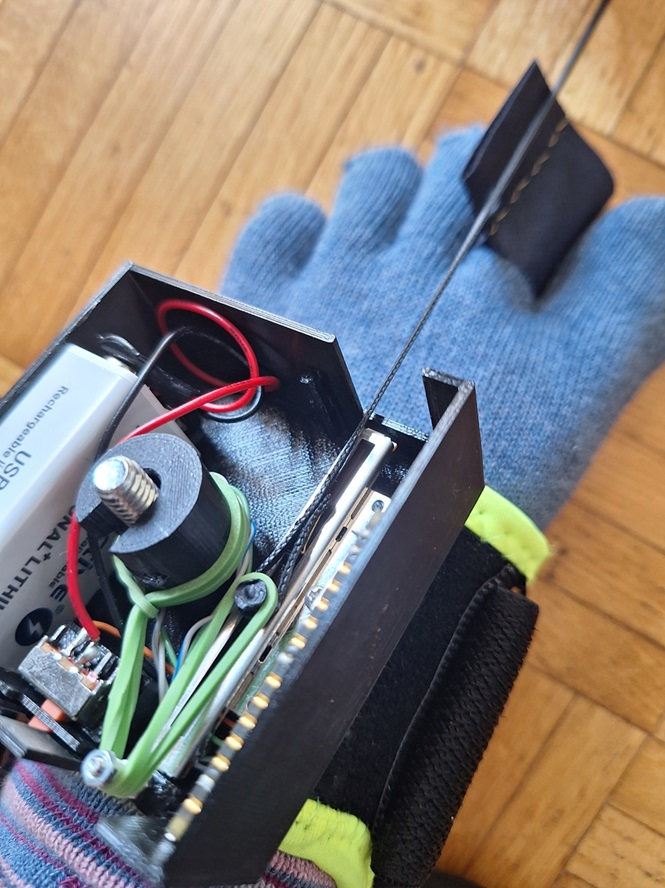

 

- __WARNING__: be mindful of the wires inside, don't squeeze or pinch them when you screw on the central pillar, otherwise they might break and you will have to solder them again

 

- Prepare a string to attach to toes and make a loop on one end
- Attach this loop to the attachment on the sensor slider
- Do not shorten the other end of the string yet!

 

- Get a rubber band and loop wrap it around the central pillar, so that the leftover end is pointing towards the 20mm m2 screw
- Loop the band around the screw and onto the attachment on the sensor slider 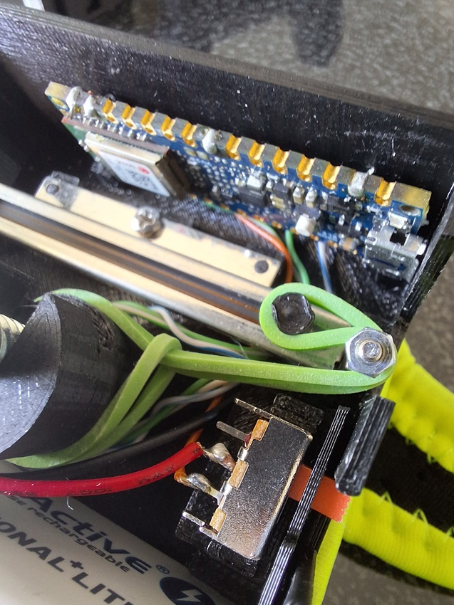

- __ALTERNATIVE:__ Nook for different length rubber band - use the nook to attach a zip-tie or similar item with an elastic band, that you will then wrap around the 20mm M2 screw and onto the sensor slider.

 

- Pull on the string to test how much force is needed to move the slider, especially when the rubber band is fully extended
- The elastic band should be able to provide enough elasticity so that the slider is always under some amount of tension

 

- Also consider the fact that the "neutral" position of the toes in a "flat" position is supposed to equate to the slider being somewhere in the middle of the sensor

 

- If everything fits now is the time to measure out how much string you need to tie it to your toes
- Again, pay attention to the neutral "flat" position, and take that into account when measuring out how much string you need when the slider is somewhere in the middle of the sensor

 

- Refer to the demo clip at the top, it features the intended range of motion and can help you visualize how to measure the correct length of the string

---

## Using the OVRTTconsole

### General instructions:

Make sure Bluetooth is enabled on your PC.

Turn on both trackers.

Run the OVRTTconsole.exe file.

OVRTT console should start and automatically connect and subscribe to both trackers.
It might take up to 30sec for the console to find the proper BLE signals and connect to them. During this time, the console might appear unresponsive. If no connection can be established after around 30sec, the console should relay this and you can 'e' to exit, then start the OVRTT console again.

On success, you should see a message saying that the connection was successful for each OVRTT tracker.

Assuming the connection to both trackers was successful, calibrating the values is recommended on each startup. If you do not calibrate the values, the angle of your bend/curl/flat position can be off by a significant margin. However, even without calibration, the OVRTT console will begin sending the data, through the defined OSC parameters, as soon as a successful connection to both trackers is established.

You can enter the calibration routine at any time, as long as the console is connected to both trackers.

Start the calibration by pressing 'c' or space bar on your keyboard. Calibration always starts with your left foot first.

The first value you need to calibrate is how far you can comfortably curl your toes in, towards your sole. Find a comfortable position of your toes fully curled in and press 'c' or space bar. 

The second value you need to calibrate is a neutral flat position of your toes. Find a flat surface to stand on and press 'c' or space bar. 

The third value you need to calibrate is how far your toes can bend backwards, towards your knee/ankle. Find a comfortable position with your toes fully bent backwards and press 'c' or space bar.

Repeat the three steps above for your right foot.

The console should display which value is currently being calibrated in the routine.
During calibration the values are only read from the trackers, they are not sent through OSC. You must finish the calibration routine to being sending values through OSC.

When the calibration is complete, the console should say "Calibration complete!"

If you want to redo the calibration, press 'c' and redo the full routine.

After a successful calibration routine, the OVRTT console will automatically begin sending the data through the defined parameters.

If everything is set up correctly, you should see the values being sent to VRC, if you open the OSC debug menu in game.

At any point in time, even during calibration, you can press 'e' to exit the console. If for some reason the console is stuck and will not accept keyboard inputs, you can close it by pressing the x for closing the window, or end the process with the Windows process explorer.

### A few points on calibration

Calibration is important so that the console can correctly identify the range of your toe movement, and for this it needs three
reference points:
1. the edge-most value of curled toes
2. the edge-most value of bent toes
3. the value at which toes are flat

Because the tracker is a simple, wearable analogue device, every time you put it on, those values might shift a little, so they need to be corrected. This is the point of calibration.

In a perfect scenario, each time you put on the tracker, the reference values for the range would equal the raw default values the tracker sends:
- fully curled toes = 0
- fully bent toes = 1023
- default flat toes = 511

where would equal to the 'x' position of the potentiometer, as one might expect;

|x--------------------------| - for curled toes

|-------------x-------------| - for flat toes

|--------------------------x| - for bent toes

In this ideal case, the raw values correspond perfectly to the expected values. But practically, this will not be always true.

 

Here is a more common example of how these values might actually end up as;

|-x-------------------------| - for curled toes

|-----------------x---------| - for flat toes

|-------------------------x-| - for bent toes

In this case, the user has more 'travel' when curling their toes, but also never fully maxes out the edge value, the flat value is shifted to one side, and the bent value is also never maxed out.

Lets say those values approximate to:
- curled = 15
- bent = 950
- flat = 680

when read from the tracker raw.

Calibration will, in this case, 'shift' the midpoint (flat) value accordingly, and split the range in three parts; from min to close to midpoint, a small midpoint range, and from close to midpoint to max. Then it will map the raw values to a range from 0.00 to 1.00 accordingly:
- raw values from 15 to about 674 get mapped to values from 0.0 to 0.49
- raw values from about 675 to 685 get mapped to a value of 0.5 - the midpoint
- and raw values from 686 to 950 get mapped to values from 0.51 to 1.00

When calibrating, one should pay some attention to the values. Ensure the value of the curl/bend is close to the edge-most (0 or 1023) value, and that the midpoint falls in-between those values, ideally with a margin of more than 100 from either curl or bend.

### Calibration TLDR:
When calibrating, the recommended values are as follows:

- curl < 100
- bend > 900
- flat between 200 and 800
 
If curl or bend exceed the recommended limit above, make sure the margin for the flat value is more than 100 from the other closest bend or curl value.

This should give a nice margin on both sides and the normalization can compute a range that is not overly sensitive on one side.

Also ensure that the calibrated values follow this "formula": 

curl < flat < bend 

(or vice versa, if your tracker is sending the opposite values, that is curl at 1023 and bend at 0). 

If for some reason the values you calibrated do not follow this formula, the calibration routine will finish with a warning message saying that the newly calibrated values have not been saved, but have instead reverted to the default 0/511/1023 values. In this case, the user should simply redo the calibration routine and make sure the formula is followed.

### config.conf file values and recommendations

#### General instructions

Comments: everything after a * symbol in a line is ignored

Format: `name=value`

'name' - case sensitive and must conform to expected inputs. The default config file contains all possible inputs.

'value' - only alphanumeric (A-Z, a-z, 0-9) characters allowed, along with these 4 symbols: / . - _

Spaces are ignored.

Empty lines are ignored.

The config file is read line by line, the order of the lines does not matter. However, if you wish to use `debug_out` by setting it to `true`, it is recommended that it appears first, above all other values, as is the case in the original config file.

If one of the required values is missing, the OVRTT console will revert to a built in default value, however this missing default value will not be written to the config file.

The default values in the OVRTT console can be viewed in the program source code, or you can reset the config file with the console.

To reset the config file, delete (or rename) the config file from the folder where the OVRTTconsole.exe is located, and then run the console, this should create a new config.conf file with all the required default values filled out.

Alternatively, you can re-download the release from the GitHub page, and extract the config file to overwrite the one that is located in the same folder as the OVRTT console executable.

The config file is read only once, when the OVRTT console is started.

While you can edit the config file when the console is running, it is not recommended to do so.

Exit the console, edit and save the config file, then start the console again.

If you have edited the config file while the console is running, the console needs to be restarted to read the newly edited config file.

#### Values and descriptions

##### Debugging

- `debug_out` can only equal to `true` or `false` - example: `debug_out=false`; if set to `true` there will be some extra information printed in the OVRTTconsole that might help you with troubleshooting various issues, these lines will be marked with `DEBUG:` for greater visibility

##### Tracker information

- `left_tracker_name` and `right_tracker_name` __MUST__ equal to whatever the tracker name is set to in the Arduino sketches - example: `left_tracker_name=NanoBLE-LEFT`; in the default scripts these values are set to `NanoBLE-LEFT` and `NanoBLE-RIGHT` respectively

- `left_tracker_service_UUID` and `right_tracker_service_UUID` __MUST__ equal to whatever the service UUID is set to in the Arduino sketches - example `left_tracker_service_UUID=180c0000-0000-0000-0000-000100010011`; in the default scripts these values are set to `180c0000-0000-0000-0000-000100010011` for the left, and `180c0000-0000-0000-0000-000100010001` for the right tracker, the difference is in the second to last character

- `left_tracker_characteristic_UUID` and `right_tracker_characteristic_UUID` __MUST__ equal to whatever the service characteristic UUID is set to in the Arduino sketches - example: `right_tracker_characteristic_UUID=2A56`; in the default scripts both of these values are equal to `2A56`

- __NOTICE:__ it is crucial that all the above values match the ones in the Arduino sketches, otherwise the OVRTTconsole will be unable to connect to the trackers

- Here is a picture of the default setup, showing both Arduino sketches and the config file: -picutre-

##### OSC settings

- `OSC_send_IP` this is the IP address that the OSC sender will send the data to, it should equal to `127.0.0.1` if VRChat and OVRTTconsole are running on the same PC. It is possible to send OSC data over the network to different computers, but I've never done so and don't plan to, so I cannot provide any useful information if that is how your PCs are set up

- `OSC_send_port` is the port that the OSC sender will send data through, it should equal to `9000` if OVRTTconsole is the only program that sends data to VRChat, however you should also read the recommendation below

- __RECOMMENDATION:__ If you use more than one OSC input, and especially if you use multiple OSC outputs from VRChat, you should probably use some sort of OSC router. I use the OSC router that comes built in to [VRCOSC](https://github.com/VolcanicArts/VRCOSC);
  * if you decide to use an OSC router, you will need to match the `OSC_send_port` value to whatever it is set to in the router software, my setup looks like this -picture of my VRCOSC + config file-

 

- `OSC_receive_IP` and `OSC_receive_port` are unused and can be left as default. I initially planned for some extra functionality, but scrapped it shortly after, and never bothered to remove these.

 

- `left_foot_param` and `right_foot_param` should equal to OSC paths and parameter names that you will add to your avatar's parameters - example: `left_foot_param=/avatar/parameters/LeftAllToes`; the `/avatar/parameters/NameOfParameter` path format is specific to VRChat and you can read more about it in the [VRChat OSC documentation](https://docs.vrchat.com/docs/osc-avatar-parameters)

##### Data & calibration

- Values in this segment are supposed to equal to the raw values trackers are going to send to the OVRTTconsole. You can read more about this in the "A few notes on calibration" section above.

- If you're using default settings, have soldered the linear senors as recommended, and are using the default Arduino sketches unchanged, the values should be as follows:
  * `left_foot_flat=511`
  * `left_foot_curl=0`
  * `left_foot_bend=1023`
  * and same for the right tracker

- If you decided to solder the linear sensor the other way around, you should swap the curl and bend values.

- An easy way to figure out what kind of values your sensor is sending is to connect it to the OVRTTconsole and press 'o' to see the values in real time. Another way is to hook up the Arduino board to a PC with the USB cable and upload a sketch that has the optional "Serial monitor" lines uncommented, so you can view the values in the Arduino IDE Serial monitor. Move the slider to one end and note the value being sent. The curl value should equal to the one when the linear sensor slider is fully pushed to the side closest to your toes.

- If you have modified the Arduino sketches to send different values, or have modified the OVRTTconsole source code to send/receive different values, your setup will probably differ in such ways that I cannot help you.

---

## Configuring your avatar

### Confession and forewarning 
I know next to nothing when it comes to modifying VRChat avatars in Unity/Blender. This part the guide will be written in pretty vague terms, and there are things I will probably get wrong. I had a lot of help from a friend, who assisted with setting up a test avatar, but unfortunately I am unable to release it as an example, due to it's license. So be warned, if you don't know how to do some rather complex stuff in Unity/Blender, I will be unable to help and you will have to seek assistance elsewhere.

### General steps needed to modify your avatar

- Add two float parameters in your Avatar's parameter configuration in Unity. These parameter names should equal to whatever they're set in the config file. Default example: `LeftAllToes` and `RightAllToes`

- The next step will differ, depending on whether your avatar already has fully functioning toe bones or not. Again, friendly warning, I am not a Unity/Blender expert, there are probably a few things in this part of the guide that are missing/wrong or might lead to issues with your avatar. 

#### If your avatar has toe bones

- If your avatar has toe bones and you can move them freely, make 3 animations in unity for each foot;
  * One for all toes fully curled in
  * One for all toes in a neutral flat position
  * One for all toes fully bent backwards

#### If your avatar does not have toe bones

- Use Blender to create 3 blendshapes for each foot on your avatar:
  * One for all toes fully curled in
  * One for all toes in a neutral flat position
  * One for all toes fully bent backwards
  
 

- Once you have the animations/blendshapes, the process should be pretty much the same

- In your FX layer, first add two float parameters in the parameters tab, they __MUST__ have the same names as the parameters under your avatar parameter configuration

- For each foot you will make a new layer in the FX layers tab and make a blendtree inside that layer

- Add the 3 blendshapes/animations to the blendtree, starting with the animation for curled toes. Don't mix and match left/right sides. The animations/blendtrees for the left foot go into the layer for the left foot only! Same for the right foot! 

- Now add the parameter to the blendtree, again pay attention to left/right side 

- Now the blendtree should have a slider which you can control with your mouse. If you slide that slider from left to right, the parameter value should change from 0.0 to 1.0, and the animations/blendshapes tied to it should light up, depending on where the slider is located in real time

- It should be possible to see this change in real time, if you turn on the Game mode view in Unity by pressing the play button

- This is pretty much it, you can now upload your avatar and hope to whatever VR god that the setup works. If it doesn't, I will likely not be able to help with the avatar setup.

---

## Troubleshooting

- Make sure your batteries are charged...

### Bluetooth issues in general

- I've done some limited amount of testing with the OVRTT trackers, here are my general findings:
  * Use a separate USB Bluetooth dongle that has BLE capabilities, rather than the one built in on your motherboard, I use the TP-LINK UB500 (make absolutely sure that Windows is using the dongle, for that you might have to disable the motherboard Bluetooth device in the Windows Device manager)
  * Get a USB extension cable and attach the Bluetooth dongle in such a way, that it is always within 9 feet of you, as you move around. It is better if it's closer to the floor/wherever your feet will be.
  * I am using the full Index kit with 3 Vive 3.0 trackers and lose connection to the OVRTT trackers quite often if I'm more than 10 feet away. I can only imagine this gets worse with even more Vive trackers/other Bluetooth devices others might use.

 - The OVRTT console will stop sending data if it loses connection to one or both trackers. You will have to fully restart the console in that case. If it happens often, you'll have to figure out why pretty much on your own.

### OSC issues
- Make sure OSC is enabled in VRChat

- Initially I've had issues sending test data directly to VRChat via the OVRTTconsole. I haven't been able to find the culprit, but using an OSC router seemed to fix that issue. I highly recommend using VRCOSC, even if you only use one device to send data, and no devices to receive OSC data. You can disable all other functionality of VRCOSC and only use the OSC router. I believe there are other OSC routers out there, but I haven't used anything other than VRCOSC.

- Using the VRChat in-game OSC debugger can be quite helpful at troubleshooting your issues. If the OVRTT console is running as expected, you should be able to see the two parameters being sent to the game via the OVRTTconsole. If your trackers are working as expected and the configuration of the OVRTTconsole is correct, you should see the values change in real time in the VRChat OSC debugger. -video clip-

### Avatar parameters

- Avatar parameters are stored in a .json file located on your PC in `~\AppData\LocalLow\VRChat\VRChat\OSC\{userId}\Avatars\{avatarId}.json`

- If you're sending the values to VRChat, but the values appear weird or off, you can check the avatar's .json file and make sure the names/addresses of the parameters are correct and the `type` of the parameters is set to `Float`

- You can read more about [VRChat's OSC documentation here](https://docs.vrchat.com/docs/osc-avatar-parameters)

### OVRTTconsole issues
- I honestly don't know what to type here. The console is pretty much built to work if everything is correctly set up, otherwise it shuts down. Sometimes error messages are included, but I don't think I've covered every possible thing that can go wrong with an error message. You can enable the `debug_out` option in the config file by setting it to `true` to see if you can gleam any relevant information from the additional DEBUG information.

- If the console does not start after you run it, or it appears that it instantly closes, your best bet is to download the latest version of the Microsoft Visual Studio 2022 and import the project file with the source code. Visual Studio should automatically detect any missing dependencies and guide you through the installation. You can then run console through the Visual Studio debugger, to make sure it works. After a successful build with Visual Studio debugger, you can then publish the project locally on your PC to get the executable from which you'll run the console.

---

## Miscellaneous 

- It might be smart to include smoothing over the OSC parameters, so that other people can see smooth movement of your toes. Here is one such project that looks like it provides all the necessary things - [OSCmooth](https://github.com/regzo2/OSCmooth)

---

- As it stands right now, I don't feel much motivation to continue developing this project. As of this release, don't expect any updates, __unless a crucial security flaw is found!__ In that case, I might update the OVRTTconsole, but only to eliminate the security flaw. I will for sure update this README file if such an issue is found though, so that users can stay informed of any potential risks.

- All that said, I would very much like to see this project continued, or perhaps even see a new project spawn from this general idea. This is why everything included in this project is open source.

- It was a fun ride, but I'd like to focus on a few other things now. Thanks for checking this thing out, and I wish you all the best, whether or not you decide to build this thing!

- If more than 3 people actually end up building this, even if they don't use it much, I will consider this project a success. If more than 10 people build and use it, I will consider this project a viral success.

- And finally, I would like to thank everyone who has helped me create this thing. There is no way I could get this far solo. I love you all!
